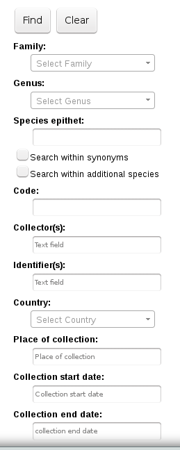
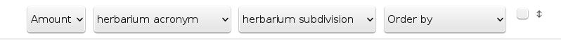
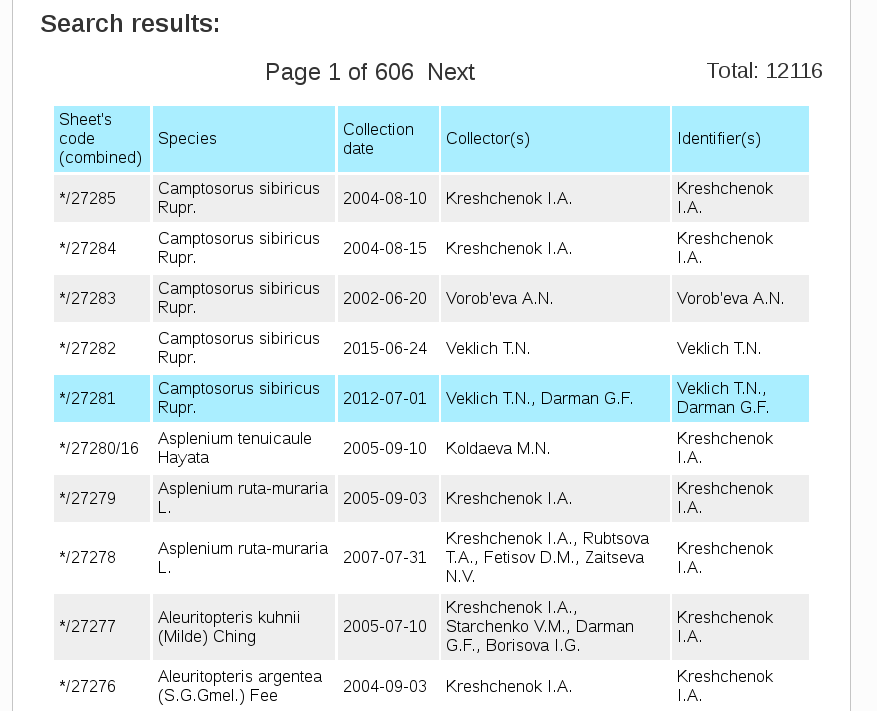
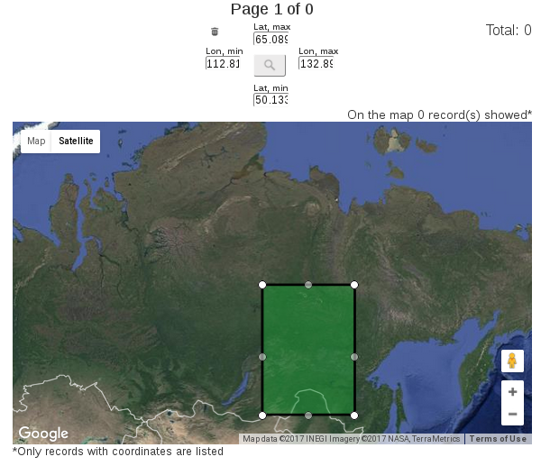
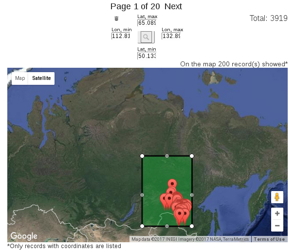

==============================
Digital Herbarium: Basic Usage
==============================

.. |---| unicode:: U+2014  .. em dash


Features
--------

Accessing to the Digital Herbarium's data is provided via the
`web-page <http://botsad.ru/herbarium>`_
on the official website of the Botanical Garden Institute
or :doc:`HTTP API service <http_api>`. The latter approach is used
for making search queries automatically (from `R <http://r-project.org>`_,
`Python <http://python.org>`_ or other computational environment).

Main features of the search service:

* search in a given time interval either by date of collection or date of identification fields;
* accounting species synonyms when searching;
* search in a given rectangular region;
* search within additional species (only for multispecies herbarium records);
* search by record codes (e.g. field number, inventory number etc.);
* search by the country of origin;
* search by taxonomic name, e.g. family, genus or species epithet;

Search menu
-----------

General search possibilities are available via the
search menu from the Digital Herbarium's web-page
(:ref:`Fig. 1<fig1>`)

.. index:: search form

.. _fig1:



   Fig. 1. Basic search menu


When search conditions are given simultaneously, the service is trying to perform an **AND**-type
query; it retrieves records satisfying all search conditions. Currently  only **AND**-type
search queries are available. To perform **OR**-type queries  it is recommended
to use the :doc:`HTTP API <http_api>` service.

Values of **Family**, **Genus** and **Country** search fields can be
selected via drop-down menu that rises when typing.

Start date of collection and end date of collection
are filled out from pop-up calendar when the mouse is hovering
these fields.

If only start date of collection is given,  the service 
retrieves records having later dates in the
corresponding field.

If only end date of collection is given,  the service 
retrieves records having earlier dates in the
corresponding field.

If start date of collection and end date of collection are given,
the service retrieves records if its corresponding date interval
intersects the given.


Regarding the following text fields  |---|
**Species epithet**, **Code**, **Collectors**, **Identifiers**, **Place of collection** the
condition satisfaction assumes containing the given value as a
sub-string in the corresponding field (case insensitive comparison is performed).

If one performs search in the  **Collectors** or **Identifiers** fields
and fills these fields with Cyrillic letters, the service will automatically
transliterate the given value into English (Latin letters)
and return records satisfying both Cyrillic and transliterated values.
If one provide the value only in Latin letters, no transliteration will be performed.
Therefore,
If you try, for example,
to find records including "bakalin" as a sub-string in the field **Collectors**,
the search  will return the records which field **Collectors** (internally **Collectedby** field)
includes the string "bakalin" (reverse transliteration (to Cyrillic letters)
in this case wouldn't be performed);
If you try to search "бакалин" (Cyrillic equivalent of 'bakalin') combined
search results for both "bakalin" and "бакалин" queries will be returned.


Boolean fields **Search within synonyms** and **Search within additional species**
indicate that, in the first case |---| the search engine will take into account known (to the system)
table of species synonyms, and in the second |---| the search engine do searching within additional species
if those are provided.

.. warning::

    When do searching within species synonyms, the search engine uses the table of species synonyms that,
    in turn, is being dynamically rebuilt each time records in the *Table of known species* are updated. The *Table
    of known species* can include errors. This could lead
    to surprising search results. These types of drawbacks (caused by incorrectness of species synonym
    relationships) tend to disappear in future, as the *Table of known species*
    will become more error-less.


.. note::

    Search within synonyms works in cases when the exact names of the pair (genus, species epithet)
    are given.


Search by **Code** field
````````````````````````
Herbarium records stored in Digital Herbarium of the BGI use triple coding system.
Each record is provided with 1) inventory number (optional), used in the Herbarium's storage;
2) mandatory **ID** field (unique, digits only), assigned by the system automatically;
3) field number (code), assigned by the collector (it is optional and quite arbitrary);

Therefore, the table of search results includes the column **Complex code**, which accumulates
codes of these three types.


**Complex code** has the following structure:

.. note::

    Inventory number (if provided) or \* symbol/ID code/Field code (if provided)


So, the **Complex code** values can look as follows:

* \*/27031/M.I.38 |---| denotes that the inventory number isn't provided, ID = 27031, and field code is M.I.38;
* 42/27029 |---| denotes that the inventory number is 47,  ID = 27029,  field code isn't provided;
* the following form of the code can take place as well: 132123/32032/F-3829-3k, where inventory number is 132123, ID is 32032 and
  field code is F-3829-3k (fake example);


When do searching by **Code** one should
provide either an inventory number, ID or field code. For example, if
the search field's value is "231" the search engine will
return records including "231" as a sub-string
in either the inventory number, ID or field code.


Filtering search results
------------------------


Standard filtering interface allows to restrict
results of searching by Herbarium's acronym, Herbarium's subdivision
or select desired number of items showed per
page :ref:`Fig. 2<fig2>`.

.. index:: search results filtering

.. _fig2:



   Fig. 2. Search filtering menu

It has the following fields:

* **Amount** |---|  the number of records showed per page;
* **Herbarium acronym** |---|  filtering by Herbarium's acronym;
* **Herbarium subdivision** |---|  filtering by Herbarium's subdivision;
* **Order by** |---|  ordering rule (choose field you want to perform ordering the results);

Results of search request with applied filter (records only under VBGI-acronym are shown) are presented
on the :ref:`Fig. 3<fig3>`.

.. _fig3:



   Fig. 3. Search results tab


In the tab **Common Info**  a table with the records satisfying
current search and filtering conditions is shown
(if no searching/filtering
conditions were provided all published records are shown,
by default the number-per-page is equal to 20).

The **Details** tab activates when a specific
Herbarium's record is clicked. It shows
minified version of the Personal web-page of the record.

The **Map** tab is a copy of **Common Info** tab
excluding records with no coordinates (records with coordinates are rendered on the Google
map as clickable markers).

One can click **Previous** or **Next** (switch page)
to get another portion of search results.

The **Automatization tools** tab includes general information on
performing queries using
:doc:`automatization possibilies <http_api>` provided by the web-application.

Working with the map, one can filter
search results by user-defined rectangular area.
To do that, just initialize a rectangular area by
pressing |SB|, edit the appeared rectangular region,
and press |SB| again to activate the search
(See :ref:`Fig. 4<fig4>`, :ref:`Fig. 5<fig5>`).

.. |SB| image:: /files/search/map_search_button.png
   :width: 25px

.. index::  map, rectangular area, search by region

.. _fig4:



   Fig. 4. Initialize filtering region


.. _fig5:



   Fig. 5. Getting results of geographical filtering/searching


To clear particular  search condition
click small-trash icon near the corresponding search field.

To clear all search conditions press the |CB| button.


.. |CB| image:: /files/search/clear_button.png
   :height: 20px

.. index::  search in a region

Search within polygonal regions isn't
supported by current database backend,
but such behavior could be emulated programmatically
with the help of the :ref:`HTTP API Service <search_httpapi_examples>`.