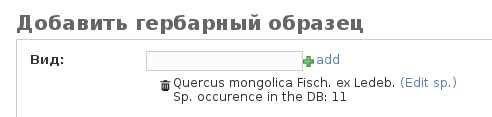
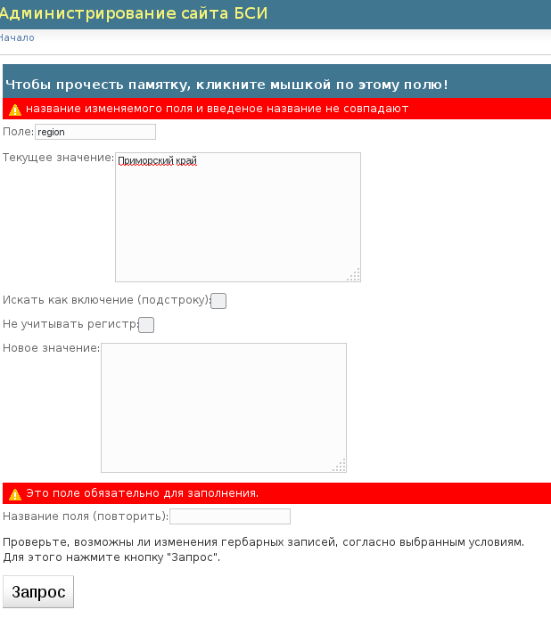

===================================================
Администрирование электронного гербария БСИ ДВО РАН
===================================================

.. contents:: :local:

.. |---| unicode:: U+2014  .. em dash

.. |--| unicode:: U+2013   .. en dash

--------
Введение
--------

В документе изложены основные принципы работы с формой администрирования, ее основные функции,
права пользователей, описание полей, а также рекомендации и соглашения об их заполнении.

.. index:: аутентификация, сессия, длительность сессии, безопасность

Аутентификация и безопасность
-----------------------------

Аутентификация осуществляется по предоставленному имени пользователя и паролю.

Пароль рекомендуется сменить после первого успешного входа в панель администрирования. 
Это можно сделать, перейдя по ссылке в правом верхнем углу окна панели администрирования. 

Пароли не хранятся в открытом виде в системе, у администратора системы (или сотрудника с правами суперпользователя) не существует (кроме прямого подбора) способа, чтобы узнать пароль; однако, суперпользователь может изменить пароль любого другого пользователя.

После ста неудачных попыток авторизации IP адресс, с которого были сделаны неудачные попытки, блокируется на час.

Если пользователь в течение 16 часов работы в системе не производит никаких действий |--| сохранений, переходов на другие страницы, то срок валидности его сессии истекает. 
По истечении срока валидности сессии пользователю необходимо пройти аутентификацию заново (ввести имя пользователя и пароль), чтобы иметь возможность редактировать образцы. 

.. index:: структура, гербарная запись, удаление гербарных записей

-------------------------------
Структура электронного гербария
-------------------------------

Электронный гербарий представляет собой многопользовательское web-приложение, которое позволяет
организовать хранение\\изменение\\добавление данных с учетом разграничения пользовательских прав, с учетом названий гербария и гербарных подгрупп.

Разграничение гербарных записей в общей таблице осуществляется по двум основным полям |--| принадлежности определенному гербарию (гербарному акрониму) и подразделу гербария. 

Например, может потребоваться необходимость внутри данного гербария (например, VBGI), выделить биоморфологический гербарий, или коллекции грибов и пр. Для этих целей могут использоваться подразделы гербария.

Права пользователей могут распространяться как на образцы, принадлежащие данному акрониму, и\\или быть ограниченными определенными подразделами гербария.

Пользовательская поисковая форма (размещаемая на странице http://botsad.ru/herbarium)
позволяет осуществлять фильтрацию результатов поиска по гербарным акронимам и\или подразделам гербария.

Каждая гербарная запись, независимо от принадлежности гербарному акрониму 
или подразделу гербария, получает при своем сохранении уникальный,
привязанный только к этой записи, целочисленный номер ID.  Он назначается системой автоматически.

В системе управления гербарием удаление гербарной записи означает присвоение ей внутреннего статуса
"DELETED" ("Удален"), что подразумевает исключение его из списка образцов и 
отключение возможности редактирования. Данный механизм реализован с целью минимизации возможности случайного удаления
гербарных записей. 

Полное удаление гербарного образца из таблицы может выполнить только суперпользователь системы и только по
одному образцу за одну операцию (множественное удаление образцов из их общего списка приводит 
к назначению выделенным образцам внутреннего статуса "DELETED" ("Удален").

.. index:: акронимы гербария

Гербарные акронимы
------------------

Гербарные акронимы |---| идентификаторы принадлежности тому или иному гербарию
(например, гербарию БСИ ДВО РАН, или гербарию Амурского филиала БСИ ДВО РАН)
хранятся в отдельной таблице акронимов,
редактирование которой разрешено только суперпользователю
(см. о правах суперпользователя в разделе `Группы пользователей и права`_).

Пользователи, авторизуемые в системе администрирования, привязаны к тому или иному акрониму.
Когда они сохраняют заполненный гербарный образец,
доступное только для чтения (изначально пустое) поле акронима,
заполняется автоматически в соответствии с этой привязкой.

Каждая запись таблицы акронимов (в настоящий момент таблица хранит записи |---| VBGI, AmBGI, SAKH)
хранит информацию о физическом размещении гербария (его адрес на англ. языке),
привязку к пользователям, собственно сокращенное названиe.

Акронимы используются для разграничения прав кураторов.
Куратор гербария привязывается к тому или иному акрониму, но не имеет
доступа к гербарным записям принадлежащим другому акрониму.

Информация, содержащаяся в таблице акронимов
(адрес гербария, международное обозначение гербария),
используется при автоматизированном создании макетов этикеток.

Если требуется внести изменения в таблицу акронимов, например,
исправить AmBGI на ABGI, или что-то подобное, изменить адрес гербария,
нужно обращаться к сотруднику с правами суперпользователя системы.

.. index:: подразделы гербария

Подразделы гербария
-------------------

Подраздел гербария |---| необязательное автоматически назначаемое поле
при добавлении гербарной записи.
Оно может быть пустым, либо заполняется при сохранении образца с учетом привязки
конкретного пользователя к подразделу гербария.

Если пользователь с правами куратора привязан к определенному подразделу
гербария, то он является куратором только
данного подраздела (см. также `Группы пользователей и права`_).

Таблица гербарных подразделов с их наименованиями и привязкой к
конкретным пользователям редактируется сотрудником с правами суперпользователя.

Если пользователь, редактирующий гербарий, не привязан ни
к какому гербарному подразделу, то при сохранении записи данное поле
остается пустым (исключение составляют кураторы акронима, а также суперпользователи,
которые могут выбрать подраздел гербария явно).

.. index:: пользователи, группы, суперпользователь, удаление гербарных записей

Группы пользователей и права
----------------------------

Суперпользователь
-----------------

Суперпользователь |---| имеет права на все, 
за исключением удаления\\изменения опубликованных гербарных образцов.
Тем не менее, он может изменить статус опубликованного образца на неопубликованный.

Суперпользователь может полностью удалить гербарный образец из таблицы записей только
нажав кнопку "Удалить" в нижней части формы редактирования гербарного образца. 

Множественное выделение образцов с последующим выполнением действия "Удалить гербарные образцы"
суперпользователем не приводит к полному удалению образцов из таблицы, а лишь
назначает выбранным образцам статус "DELETED". Такие образцы можно легко
восстановить при необходимости. 

.. index:: куратор

Куратор
~~~~~~~

Куратор гербария |---| осуществляет мониторинг всех гербарных записей в рамках акронима, к которому он привязан.

Кроме того:

- куратор может быть привязан только к одному гербарному акрониму;
- куратор осуществляет публикацию (и\\или снятие с публикации) гербарных образцов;
- куратор может редактировать и просматривать любые гербарные образцы в рамках своего акронима;
- куратор не может удалять виды, рода или семейства, но может их добавлять и изменять; 
- куратор может исключить вид из результатов поиска в всплывающих подсказках, присвоив ему статус "Deleted";  
- куратор может добавлять\\изменять названия уже добавленных видов (при этом изменения скажутся сразу на всех образца, у которых указан данный вид: например, если вид *Betula mandshurica* в таблице видов переименовать на *Betula davurica*, то все образцы, где был указан до переименования вид *Betula mandsurica*, после переименования будут иметь вид *Betula davurica*);
- куратор может удалять любые образцы в рамках своего акронима

.. index:: куратор подраздела

Куратор подраздела гербария
~~~~~~~~~~~~~~~~~~~~~~~~~~~

Если имя пользователя с правами куратора привязано к какому-либо гербарному подразделу, то все права куратора ограничиваются только данным подразделом. Остальные права куратора гербарной группы идентичны правам куратора гербария.

.. index:: наборщик

Регулярный пользователь (наборщик)
~~~~~~~~~~~~~~~~~~~~~~~~~~~~~~~~~~

Осуществляет набор данных от своего имени. Акроним гербарной записи при этом назначается автоматически, исходя из привязки пользователя определенному гербарному акрониму.

Регулярный пользователь может быть дополнительно привязан к подразделу гербария. В этом случае, сохранение образца влечет автоматическое назначение подраздела данной гербарной записи.

- регулярный пользователь может создавать,  просматривать и редактировать уже созданные гербарные записи;
- может создавать новые виды; 
- не может создавать рода и семейства;
- не может изменять статус видов;
- не может публиковать\\снимать с публикации гербарные записи;
- не может удалять созданные гербарные записи;

Существует еще дополнительный набор прав |---| "Редактор мультивидовых сборов", который подразумевает, что
форма редактирования образца включает поля, отражающие присутствие дополнительных
видов в данном гербарном сборе; в обычном
гербарии сосудистых растений такая функция не нужна,
поэтому она включается только при присвоении пользователю данного набора прав.

.. index:: поля формы

--------------------------
Поля формы и их назначение
--------------------------

Любые поля формы, выделенные жирным шрифтом, обязательны для заполнения. 

В форме редактирования гербарных образцов такое поле одно |---| это поле **Вид**.

.. index:: мультиязычность

Поддержка альтернативного языка
-------------------------------

Заполняя данные в цифровой гербарий, прежде всего следует ориентироваться на международное научное сообщество.
Таким образом, предпочтительным языком заполнения является английский. 

Тем не менее, некоторые поля, а именно `Страна`_, `Регион`_, `Район`_, `Место сбора`_, `Высота`_, `Заметки`_,
`Примечание к виду`_ поддерживают эмуляцию двуязычного заполнения при помощи спецсимвола "|".

Эмуляция двуязычности работает следующим образом. Разграничение языков осуществляется при помощи специального символа "|". Например,
поле `Регион`_ может содержать: "Дальний Восток России|Russian Far East" (*кавычки в форме администрования не ставятся*). 
В этом случае, система автоматически будет использовать русский вариант (Дальний Восток России), если пользовательский язык просмотра страницы "русский", и
английский вариант (Russian Far East) |---| в случае, если язык просмотра "английский".

Кроме того, при выборе языка в строках с символом "|" учитываются следующие правила:

- если в строке символ "|" встречается более одного раза, система отображает строку как есть (никакого выбора языка не происходит);
- если в строке символ отделяет пустую подстроку (например, "Владивосток|   "), то строка отображается как есть (никакого выбора языка не происходит);
- порядок русско- и англоязычного вариантов в строке относительно символа "|" не
  имеет значения: т.е. "Дальний Восток России|Russian Far East" и
  "Russian Far East|Дальний Восток России" являются эквивалентными записями с точки зрения системы;
- система считает русскоязычной ту подстроку относительно символа "|", в которой больше встретилось кириллических символов;
- если число кириллических символов в обоих частях строки относительно "|"
  одинаково, или они вообще отсутствуют, англоязычной считается правая подстрока относительно символа "|".

Выбор языка для полей |--| **Дат сбора\\определения**  осуществляется автоматически системой,
исходя из текущего языка браузера пользователя.

Поля **Определили** и **Собрали** будут использовать автоматическую
транслитерацию на английский язык,
если они заданы на русском, а язык
просмотра пользователем страницы отличен от русского.
Данные поля не нужно переводить,
если они заполнены на русском, но можно сразу заполнять на английском.

.. index:: вид

Вид
---

Заполнить поле вид можно только элементом из всплывающей подсказки. Подсказка формируется по уже добавленным видам в базу, а также более 500k (по состоянию на конец 2016 г) видам из базы данных theplantlist.org.

Поиск выполняется как только набрано 3 и более символов в поле **Вид**; при этом полагается, что первые символы |---| должны состоять в названии рода, а последующие, если они идут через пробел |--| видового эпитета.
Иными словами, если мы вводим в поисковое поле **Вид**: *Tra*, то в
поиске появятся все виды с родами, начинающиеся на *Tra*,
при этом количество видимых вариантов будет
ограничено 50 вариантами; если в
поисковом поле **Вид** будет, например, *Tra ps*, то
найдутся все виды,  рода у которых начинаются  на *Tra*, и,
кроме того, видовой эпитет содержит *ps*, т.е., например, *Trapa pseudoincisa* и т.п.

Если требуемый вид отсутствует, нужно нажать рядом кнопку в виде "зеленого плюса"
и добавить недостающий вид. Если отсутствует
необходимый род и\\или семейство, необходимо обратиться к
сотруднику с правами куратора и\\или суперпользователя,
чтобы добавить недостающий род и\\или семейство.

У вида можно задать синоним. Добавление синонимов доступно на странице редактирования вида.
Подробно об этом можно прочитать в разделе `Известные виды`_.

Во всплывающем списке с известными видами (:ref:`Рис. 1<main_pic1>`)
в круглых скобках приводится общее количество записей в базе данных, содержащих
данный вид. Учитываются всё -- опубликованные и не опубликованные записи,
записи в разделе дополнительные виды, и виды, участвующие в истории определений.

.. _main_pic1:

.. figure:: files/screenshots/Screenshot_20180208_090825.png
    :alt: Всплывающий список известных видов
    :align: center

    Рис. 1. Всплывающий список известных видов

После того, как вид выбран, он отображается внизу поискового поля с указанием
числа уже внесенных в базу записей, где данный вид встречался (:ref:`Рис. 2<main_pic2>`).

.. _main_pic2:

    Рис. 2. Поле "Вид" после выбора вида

.. index:: примечание к виду

Примечание к виду
-----------------

Строка; максимальная длина |---| 300 символов. Поддерживает режим двуязычности с использованием символа "|".
Видна только пользователям с правами "редактора мультивидовых сборов".
Характеризует специфические особенности основного вида данного гербарного сбора в случае мультивидовых сборов.

.. index:: сходство

Типовой статус
--------------

Поле, доступное для редактирования только пользователям с правами куратора.

Возможные значения: пустое значение, HOLOTYPUS, ISOTYPUS, PARATYPUS, LECTOTYPUS.

Значение типового статуса отражается на генерируемых этикетках
(данная функциональность еще не реализована).

.. index:: типовой статус

Сходство
--------

Характеризует степень уверенности в определении вида данного образца. Возможные значения "affinis" (aff.), "confertum" (cf.).

Данное поле присутствует также во вкладках `Переопределения`_ и `Дополнительные виды`_.

.. index:: код образца

Код образца 
-----------

Уникальный в рамках данного акронима числовой код. Этот код опциональный и может не заполняться. Однако, в некоторых публикациях могут быть ссылки на гербарные образцы с указанием этого кода, поэтому он может быть важен.

Если данный код задан, то он отражается на этикетке; если не задан |---| вместо него используется символ "*".

Регулярный пользователь (наборщик) не имеет прав заполнять данное поле, однако его права могут быть расширены на этот случай.

По умолчанию, права на заполнение данного поля имеют кураторы и суперпользователи.

.. index:: полевой код

Полевой код
-----------

Опциональный код. Его назначает сборщик гербария; его максимальная длина 20 символов, при этом допустимо
использовать любые символы в рамках кодировки utf-8 (т.е. там могут быть и японские иероглифы).

Также может быть важным для ссылок.

Если существует, то отражается на этикетке. 

.. index:: акроним (поле)

Акроним
-------

Автозаполняемое поле. Оно доступно только для чтения для всех пользователей,
за исключением суперпользователя.

Суперпользователь может самостоятельно назначить
принадлежность образца любому акрониму.

Автозаполнение осуществляется на основе привязки пользователей к акронимам.

Одному пользователю соответствует только один акроним.

Поле используется при формировании заголовка этикетки. 

.. index:: страна

Дубликаты
---------

В поле указывается перечень гербарных акронимов (в соответствии с `Index Herbariorum <http://sweetgum.nybg.org/science/ih/>`_)
через запятую, в которые были депонированы дубликаты текущего
гербарного образца. 

Права на заполнения данного поля имеют кураторы гербарного акронима или подраздела гербария.

Информация о дубликатах, если таковая была внесена,  
отображается на персональной странице гербарной записи, а также
на этикетке-конверте. 

(отображение данной информации на обычной этикетке (для сосудистых растений)
в процессе обсуждения)

.. index:: дубликаты

Страна
------

Рекомендуемое к заполнению поле. Необходимо выбрать страну происхождения гербарного сбора. 
Поиск осуществляется по русскоязычным и англоязычным общепринятым в рамках стандарта ISO_ перечнем стран (вместо "Российская Федерация" для компактности формы при создании электронных макетов этикеток  используется "Россия").

.. _ISO: https://ru.wikipedia.org/wiki/ISO_3166-1

Данное поле отображается на английском языке на этикетке. 

.. index:: регион

Регион
------

Отражается на этикетке. Это поле с возможным автозаполнением из того, что уже было введено в базу.

Поддерживает двуязычное заполнение, описанное в разделе `Поддержка альтернативного языка`_.

.. index:: район

Район
-----

Не отражается на этикетке. Опциональное поле. 

Поддерживает двуязычное заполнение, описанное в разделе `Поддержка альтернативного языка`_.

.. index:: место сбора, экоусловия, локализация

Место сбора
-----------

Максимальная длина этого поля 600 символов. 
В этом поле следует также размещать важную информацию об экологических особенностях места сбора.

Поддерживает двуязычное заполнение, описанное в разделе `Поддержка альтернативного языка`_.

При генерировании этикетки-конверта данное поле поддерживает тэги изменения
стиля написания: **<b></b>, <i></i>** и их комбинации.  Тэг <b>content</b> |--|
приводит к **жирному** стилю написания содержимого **content**, тэг <i>content</i>, соответственно,
отвечает за *курсив*. Кроме того, поддерживаются тэги верхнего индекса **** и 
нижнего индекса ****, их также можно комбинировать со стилевыми тэгами.

Возможны вложенные конструкции тэгов.

.. note::
    Это пример описания <b>места</b> <i>сбора</i>.

    Отобразится на этикете-конверте следующим образом:

    Это пример описания **места** *сбора*.

.. index:: координаты сбора

Координаты
----------

Для заполнения можно использовать флажок на прилагаемой карте google. При изменении позиции флажка, автоматически изменяются и координаты. 
В правом верхнем углу карты есть и поисковое поле, в которое можно ввести здесь название населенного пункта и флажок переместится в центр этого пункта, если, конечно, такой будет найден (т.е. если название известно google).

.. index:: высота сбора

Высота
------

Высота над уровнем моря в метрах.
  
Поддерживает двуязычное заполнение, описанное в разделе `Поддержка альтернативного языка`_.

.. index:: gps (поле)

GPS-Based
---------

Отмечается, если координаты сбора были получены при помощи GPS; это характеристика точности позиционирования сбора; поскольку координаты сбора могут быть получены исходя из описания сбора ручным указанием положения флажка на google-карте.

.. index:: собрали

Собрали
-------

Поле-автоподсказка. Автоподсказка формируется из уже известных уникальных записей, внесенных в базу. 

.. index:: начало сбора, конец сбора

Начало и Конец сбора
--------------------

Для заполнения может быть использован всплывающий календарик (кнопка справа). Начало и конец указываются если не известна точная дата сбора, но известны, например, даты проведения экспедиции, в ходе которой был осуществлен сбор.

Если дата известна точно, то можно заполнить только одно поле |---| начало сбора; также можно указать конец сбора, таким же как и начало сбора, либо оставить пустым. 

Дата сбора отражается на этикетке, в виде, например, таком: 15 Jul 1998. 

Если известен только месяц сбора, то этот факт следует отражать указав начало сбора |---| первое число месяца, а конец сбора |--| последнее число месяца. Например, если сбор выполнен в марте, 1999 года, то начало сбора будет 1 марта 1999 г, а конец сбора |--| 31 марта 1999 г.

Если время сбора указано с точностью до года, следует поступать аналогичным образом |--| указать первое и последнее числа года |--| 1 января и 31 декабря.

.. index:: определили

Определили
----------

Поле-автоподсказка. Работает  по аналогии с полем "Собрали". Отражается на этикетке. Если ученых, участвующих в определении много, на этикетке будет указан сокращенный вариант |--| первые одна, две фамилии (сколько удастся автоматически разместить). 

.. index:: начало определения, конец определения

Начало и конец определения
--------------------------

Аналогично началу и концу сбора. Поле не отражается на этикетке.

.. index:: биоморфологический статус (поле)

Биоморфологический статус
-------------------------

Отражается на этикетке, если непусто. Возможные значения "Dev.stage partly" или "life form". Эти словосочетания и печатаются на этикетке. Специально для биоморфологического гербария БСИ ДВО РАН.

Вполне возможно, оно будет строго привязано к гербарному подразделу "Биоморфологический гербарий", и не будет появляться у пользователей, не привязанных к этой группе. 

.. index:: подраздел гербария (поле)

Подраздел гербария
------------------

Автоматически назначаемое поле и доступное только для чтения для регулярных пользователей.

Куратор акронима |--| пользователь, имеющий права куратора, но не привязанный ни к одному
из подразделов, может устанавливать значение данного поля из всплывающего списка.

Суперпользователь может редактировать данное поле и указывать подраздел гербария явно.

В других случаях поле назначается исходя из привязки пользователя подразделу.

Назначается при сохранении образца.

.. index:: заметки о сборе

Заметки
-------

Все что еще мы хотим сообщить о сборе. Для этого здесь доступно 1000 символов. 

Поддерживает двуязычное заполнение, описанное в разделе `Поддержка альтернативного языка`_.

При генерировании этикетки-конверта данное поле поддерживает тэги изменения
стиля написания: **<b></b>, <i></i>** и их комбинации. Тэг <b>content</b> |--|
приводит к **жирному** стилю написания содержимого **content**, тэг <i>content</i>, соответственно,
отвечает за *курсив*. Возможны вложенные конструкции тэгов.
Кроме того, поддерживаются тэги верхнего индекса **** и 
нижнего индекса ****, их также можно комбинировать со стилевыми тэгами.

.. note::
    Это пример описания <b>места</b> <i>сбора</i>.

    Отобразится на этикете-конверте следующим образом:

    Это пример описания **места** *сбора*.

.. index:: опубликовать запись

Опубликовано
------------

Если отмечено, то образец опубликован. 
Публиковать образцы (как и снимать их с публикации) могут только кураторы герабрия\\гербарной группы, а также суперпользователь.

.. index:: история переопределений вида

Переопределения
---------------

Переопределения заполняются, если первоначально определенный вид, потом переопределили. На этикетке, однако, при этом сохраняется первоначальные данные. История переопределений не отражается на этикетке. 

В разделе "Переопределения" можно добавить несколько определений, указав соответственно начало (и при необходимости конец) валидности определения. Последним полем блока "Переопределения" является вид, то на что текущий вид был переопределен.

Если этот раздел заполнен, то он отображается на персональной странице образца.

Если поле "Определили" пусто, а история переопределений имеется, то на этикетке будет отображена 
последняя запись из истории переопределений.

.. index:: мультивидовые сборы, дополнительные виды

Дополнительные виды
-------------------

Раздел доступен для редактирования только пользователям с правами
"Редактор мультивидовых сборов" (пользователей со специальными правами, у которых в сборах может быть больше одного вида).

Дополнительные виды заполняются по аналогии с полем `Переопределения`_, за исключением того, что  для каждого дополнительного вида имеется возможность указать индивидуальное примечание.
Данные примечания ограничены объемом 300 символов, также как и поле `Примечание к виду`_.

.. index:: запомнить текущую запись

Cохранить для добавления следующей записи
-----------------------------------------

Если отметить данную позицию, то следующий добавляемый гербарный объект будет иметь 
уже заполненные поля, как у текущего. Данная функция удобна, когда необходимо добавить 
несколько гербарных объектов, имеющих однотипное описание: собранных в одинаковом месте, в одинаковых условиях и т.п.

Прежде чем отмечать позицию "Сохранить для добавления следующей записи", важно предварительно сохранить
заполненную форму. Поэтому, рекомендуется всегда сначала нажимать "Сохранить и продолжить редактирование", а уже потом
отмечать "Сохранить для добавления следующей записи". 

Отмечая позицию "Сохранить для добавления следующей записи" пользователь сообщает системе, чтобы она запомнила ID текущего образца и использовала данные его полей для добавления следующих записей.

При добавлении последующих образцов надпись позиции "Сохранить для добавления следующей записи" дополниться
фразой "(не этот образец)", которая указывает, что информация для предварительного заполнения полей берется из какой-то другой записи (на которой позиция была отмечена).

Снятие галочки с данной позиции выключает данную функциональность.

Функциональность работает в рамках данной сессии пользователя. Если пользователь завершит работу с системой и потом снова авторизуется, функциональность запоминания полей будет отключена.

Следует иметь ввиду, что в текущей реализации данная функциональность не запоминает поля форм `Переопределения` и `Дополнительные виды` (*вполне возможно, что в будущем это будет изменено*).

.. index:: персональная страница образца

-----------------------------
Персональная страница образца
-----------------------------

Детальная информация об опубликованном образце доступна по адресу: http://botsad.ru/hitem/ID,
где "ID" это уникальный код образца, назначаемый системой. 

Также, в целях соответствия общим стандартам, валидными ссылками на персональную страницу образца являются
ссылки вида: http://botsad.ru/hitem/ACRONYMXXXXX, где ACRONYM |--| акроним гербария, XXXXX |--| уникальный числовой код.
Примеры: http://botsad.ru/hitem/VBGI133, http://botsad.ru/hitem/VBGI120

Аналогичный формат доступа к персональным страницам используется в электронном гербарии KEW: http://apps.kew.org/herbcat/gotoCiteUs.do

На этой странице указывается история определений, заметки и прочая информация, не вошедшая на этикетку.

Адрес персональной страницы не зависит от акронима и\\или гербарной группы.

.. index:: создание этикетки, этикетка

--------
Этикетка
--------

Для генерации этикеток в общем списке гербарных записей панели администрирования необходимо
выделить образцы, выбрать действие |--| "Создать этикетки" и нажать "Выполнить".

За один запрос можно сгенерировать не более 100 этикеток;
они автоматически размещаются оптимально на странице формата A4.

QR-код, размещаемый на этикетке, представляет собой URL персональной страницы образца, также указываемый мелким шрифтом сразу под изображением QR-кода.

Если среди опубликованных образцов для генерации этикетки будут выбраны и неопубликованные |--| последние будут проигнорированы,
а этикетки будут созданы только для опубликованных записей.

URL для генерации этикеток можно ввести вручную, указывая через запятую **ID** тех гербарных записей,
для которых необходимо сгенерировать этикетки.

.. note::

    Пример:
    https://botsad.ru/hitem/pdf/33682,33682,33682,33680

Такой подход може быть полезен в случае, если необходимо сгенерировать
несколько одинаковых этикеток, соответствующих определенной гербарной записи.

Генерирования этикеток путем ввода URL
возможно только после авторизации пользователя в системе.

:download:`Пример этикетки <files/sample-labels.pdf>`

.. index:: создание этикетки-конверта, этикетка-конверт

----------------
Этикетка-Конверт
----------------

Некоторые гербарные сборы предпочтительно хранить в конвертах.
С этой целью система предлагает специальный формат этикетки "Этикетка-Конверт".

Этикетка-Конверт представляет собой лист формата A4, в нижней трети которого, представляющей
лицевую сторону конверта, располагается подробная информация о сборе, а также штрих-код, оформленный в
соответствие с правилами, описанными в разделе `Штрихкодирование образцов`_ ; в центре страницы,
соответствующей оборотной стороне конверта, размещается
QR-код, кодирующий ссылку на персональную страницу образца;

Для генерации этикеток в общем списке гербарных записей панели администрирования необходимо
выделить образцы, выбрать действие |--| "Создать этикетки-конверты" и нажать "Выполнить".

За один запрос можно сгенерировать не более 100 этикеток-конвертов.

Первый вид, указываемый на этикетке-конверте |--| основной вид сбора, далее, каждый на новой строке, идут
дополнительные (сопутствующие) виды.

После располагается блок информации о сборе;
в этом блоке отображаются:

* Страна
* Регион
* Район
* Координаты сбора
* Статус координат (если координаты получены при помощи gps, то это отмечается строкой '[GPS-based]';
* Кто собрал и дата сбора
* Заметки
* Место сбора

Далее, идут примечания к видам, а также к основному сбору; Переопределения основного вида интегрируются
с примечаниями к нему.

Этикетка-конверт поддерживает автоматический выбор корейского/японского шрифта, если
слово набрано корейскими или японскими символами (в кодировке utf-8). Такую смену шрифта
поддерживают поля: `Регион`_, `Район`_, `Заметки`_, `Место сбора`_, а также примечания к
дополнительным видам.

:download:`Пример этикетки-конверта <files/sample-envelope.pdf>`

.. index:: штрихкодирование

-------------------------
Штрихкодирование образцов
-------------------------

Назначение инвентаризационных номеров важный этап систематизации гербарных накоплений.
Штрихкод размещается на гербарном листе перед его сканированием и представляет собой уникальный идентификатор
данной гербарной записи, формат которого в текущий момент принимается мировым научным сообществом.

Для генерации страницы штрихкодов  в общем списке гербарных записей панели администрирования необходимо выделить образцы, 
выбрать действие |--| "Создать штрихкоды" и нажать "Выполнить".

За один запрос можно сгенерировать не более 100 штрихкодов; они размещаются автоматически оптимальным образом на странице формата A4.
Если штрихкоды не помещаются на одной странице, генерируется многостраничный pdf-документ.

Штрихкоды можно генерировать для всех (не обязательно опубликованных) образцов, внесенных в базу.

В качестве алгоритма для создания штрихкодов используется CODE39_, а кодируемая строка имеет вид ACRONYMXXXX,  где XXXX |--| уникальный 
числовой код (ID) образца внутри данного акронима. Под штрихкодом дублируется кодируемая им строка (размер шрифта фиксирован). Над штрихкодом приводится название организации (размер шрифта динамический, выбирается так, чтобы название организации не выходило за границы штрихкода).
Оформление штрихкода сделано по образцу электронного гербария KEW_.

:download:`Пример  документа со штрихкодами <files/sample-barcodes.pdf>`

.. _CODE39: https://ru.wikipedia.org/wiki/Code_39
.. _KEW: http://apps.kew.org/herbcat/navigator.do

.. index:: таблица известные виды, статус вида

--------------
Известные виды
--------------

Все известные виды представлены в трех таблицах |--| таблице семейств, таблице родов и, собственно, названий видов.
Названия видов с авторами привязаны к таблице родов, записи таблицы родов |--| привязаны к таблице семейств. 

Таблица названий видов используется для формирования подсказок при заполнении поля **Вид** формы гербарного образца. 

Каждая запись таблицы видов имеет дополнительный статус |--| "From plantlist" (из базы theplantlist.org),
"Approved" (проверенный), "Deleted" (удаленный) и  "Recently added" (новый, недавно добавленный).

Названия видов, имеющие статус "From plantlist" или "Approved" считаются доверенными,
и образцы, в которых участвуют такие виды, могут быть беспрепятственно опубликованы куратором гербария.

В случае, если название вида имеет статус "Recently added", и оно участвует в гербарной записи, такую 
гербарную запись опубликовать не получится.

Чтобы опубликовать такую запись необходимо, чтобы куратор (или суперпользователь) изменил статус вида (проверил вид) на "Approved".

Ни куратор, ни регулярный пользователь не может полностью удалить вид из таблицы известных видов. Вместо этого, куратор может изменить статус вида на "Удаленный" ("Deleted").
Виды, имеющие статус "Deleted", не участвуют во всплывающих списках-подсказках при заполнении полей формы гербарного образца. В таблице видов отображаются все виды, в том числе и имеющие статус "Deleted".
Таким образом, статус "Deleted" должен использоваться чтобы ограничить результаты поиска во всплывающих подсказках, что может быть полезным чтобы исключить устаревшие и\\или неправильные названия видов.

Регулярный пользователь (наборщик гербария) не может изменять статус вида.

На странице редактирования вида можно задать его синоним. К данному виду можно присоединить только один вид-синоним. 
Если вид имеет несколько синонимов, можно поступить следующим образом. Допустим вид A имеет синонимы B, C, D. 
Тогда, редактируя страницы видов B, C, D можно в них указать, что они являются синонимами вида A. При выполнении поиска с учетом синонимов, информация об образуемых этим способом классах эквивалентности (синомичности) видов будет использована при формировании запроса к базе гербарных образцов.

В качестве дополнительной защиты от случайного редактирования уже проверенные (имеющие статус "Approved")
виды по истечении определенного количества дней "замораживаются". Количество дней с момента последнего
редактирования вида до "заморозки" возможности его редактирования определяется параметром
APPROVED_SPECIES_FREEZE_. Текущее значение этого параметра 30 дней. Виды, имеющие другие статусы, в том числе
статус "From plantlist", не замораживаются. "Замороженные" виды могут быть
отредактированы только сотрудником с правами суперпользователя.

.. _APPROVED_SPECIES_FREEZE:  https://github.com/VBGI/herbs/blob/master/herbs/conf.py

.. index:: таблица известные виды (поля)

Поля таблицы Известных видов
----------------------------

Название
~~~~~~~~

Название вида |--| это видовой эпитет. Значение поля хранится в нижнем регистре. Если Вы введете в данное поле, например,
**Davurica**, значение будет автоматически переведено в нижний регистр, т.е. **davurica**. 
Недопустимо включать в данное поле авторов вида (хотя бы потому, что  авторы записываются с учётом регистра).
Данное поле может включать информацию о вариациях вида или подвидах, например, **yokogurensis subsp. fragilifolia**.

Авторство
~~~~~~~~~

Авторство вида. Примеры (через точку с запятой): Maxim; L.; Kom.; (Moench) Mold.; Stephani
Данное поле хранится с учетом регистра.

В случае, если для видовой записи заданы подвидовой ранг и подвидовой эпитет авторство относится
к объекту, состоящиму из (названия рода, видового эпитета, подвидового ранга, подвидового эпитета).

Род
~~~

Название рода. Должно выбираться из выпадающего списка предложенных названий. Если нужное наименование рода отсутствует,
его необходимо добавить в систему нажав "Добавить/add" (кнопка "зеленый плюс" справа от поля; кнопка может отсутствовать,
если Ваш уровень прав не позволяет добавлять **Рода**);

Подвидовой ранг
~~~~~~~~~~~~~~~

Возможные значения данного поля: "subsp.", "subvar.", "var.", "f.", "subf.".

Если возникает необходимость определить подрод ("subg."), поле подвидовой эпитет
используется для имени подрода, при этом не происходит автоматического конвертирования имени
в нижний регистр.

Подвидовой эпитет
~~~~~~~~~~~~~~~~~
строка; используется совместно с полем `Подвидовой ранг`_. Должна быть пустой, если не задано поле
`Подвидовой ранг`_.

Статус
~~~~~~

Значение поля описано выше.

.. index:: синоним вида

Синоним вида
~~~~~~~~~~~~

Если синоним у вида отсутствует, поле должно быть пустым.
Синоним выбирается из выпадающего списка известных системе видов.
Если требуемый вид отсутствует, его
можно добавить используя кнопку "Добавить/add" ("зеленый плюс" справа от поля);

--------------------
Сообщения об ошибках
--------------------

Пользователи имеют возможность сообщить о замеченной ошибке в
уже опубликованных гербарных записях путем заполнения специальной формы
на персональной странице образца.

При отправке заполненной формы в специальной
таблице формируется запись со следующими полями:

Email
-----

Электронный адрес отправителя сообщения об ошибке; данное поле может быть незаполнено.

Описание
--------

Содержание сообщения об ошибке. Поле обязательно для заполнения.
Его максимальная длина 2000 символов.

Статус
------

Текущий статус сообщения об ошибке. По умолчанию назначаемый статус для
новых сообщений |--| `NEW`.
Возможные значения статуса |---| `NEW`, `IN PROGRESS`, `FIXED`.

Порядок обработки сообщений об ошибках
~~~~~~~~~~~~~~~~~~~~~~~~~~~~~~~~~~~~~~

Сообщения об ошибках видны в панеле администрирования всем,
имеющим доступ к редактированию гербария.

Просматривая сообщения об ошибках, можно увидеть детализацию ошибки, нажав на номер
сообщения (колонка `ID`), либо перейти к редактированию гербарной записи, связанному
с сообщением (ссылки вида `Редактировать запись XXXX`). Если у пользователя имеются
права на редактирование гербарной записи,
то переход по ссылке приведет на страницу редактирования образца. В противном случае
появится сообщение, что "страница не найдена".

Если ошибки в гербарной записи исправлены, это отмечается изменением
статуса сообщения об ошибке, при этом: статус `FIXED` устанавливается, если больше не требуется
никаких исправлений; статус `IN PROGRESS` |--|  устанавливается,
если процесс внесения изменений уже начат, но еще не закончен, и в скором времени
планируется вернуться к редактированию данной гербарной записи.

Если гербарная запись имеет необработанные сообщения об ошибках (т.е. сообщения, имеющие статусы `NEW`
или `IN PROGRESS`), то в верхней части ее персональной страницы выводится примечание, что
гербарная запись (возможно) содержит неисправленные ошибки. Поэтому, после
выполнения редактирования образца, важно устанавливать статус
связанного с ним сообщения об ошибке в позицию `FIXED`.

Удалить сообщение об ошибке, а также отредактировать содержание текста ошибки, или e-mail адрес
отправителя сообщения, может только человек с правами суперпользователя.

---------------------------------------------
Оповещение кураторов и отслеживание изменений
---------------------------------------------

Система управления гербарием позволяет отслеживать изменения при заполнении
формы редактирования гербарных записей. Такое отслеживание
особенно важно в отношении введения новых, ранее не встречавшихся в базе, значений.
Если в некоторое поле введено ранее не встречавшееся в базе значение, то это может
свидетельствовать о допущенной ошибке как принципиальной, так и в результате смены стиля заполнения
поля (например, поле может быть заполнено как <Иванов И.И.> или <И.И. Иванов>.

Таким образом, система отслеживания направлена на снижение числа возможных ошибок при
заполнении электронного гербария и унификацию стиля введения данных.

Принцип работы подсистемы
-------------------------

Настройки работы подсистемы оповещения определяются переменными
(и их значениями по умолчанию):

    * `TRACKED_FIELDS=('collectedby', 'identifiedby')`
    * `NOTIFICATION_MAILS = ('kislov@botsad.ru', )`
    * `NOTIFICATION_USERS = ('scidam', )`
    * `EXCLUDED_FROM_NOTIFICATION = ('', )`

`TRACKED_FIELDS` |--| поля, отслеживаемые системой; названия полей указываются через запятую и должны
иметь в точности такие названия, которые используются в базе данных (на низком уровне);

`NOTIFICATION_MAILS` |--| перечень адресов электронной почты, на которые могут приходить оповещения;

`NOTIFICATION_USERS` |--| перечень пользователей-кураторов акронимов/подразделов гербария, которым
могут приходить оповещения;

`EXCLUDED_FROM_NOTIFICATION` |--|  перечень имен пользователей, заполнение полей которыми не вызывает
создание оповещения в любом случае. Если гербарная запись создана пользователем, указанным в данном списке,
эта запись полностью игнорируется системой и никакого оповещения не генерируется.

Система может поддерживать различные правила генерации оповещений. В текущей версии
оповещение создается, **если значение в отслеживаемом поле** (`TRACKED_FIELDS`)
**не содержится на текущий момент в базе данных**.

Пример оповещения приведен на (:ref:`Рис. 3<main_pic3>`).

.. _main_pic3:

    Рис. 3. Пример сообщения-оповещения

* в колонке `ID` указывается **ID** гербарной записи, к которой данное сообщение относится;
* в колонке `USERNAME` указывается имя пользователя, который вызвал данное сообщение (ввел ранее не встречавшееся значение в поле);
* в колонке `DATE` приводится дата создания оповещения; с точностью до долей секунды эта дата соответствует времени сохранения гербарной записи;
* в колонке `REASON` указывается причина возникновения сообщения; здесь перечисляются поля и их значения, которые вызвали данное оповещение;
* в колонке `LINK` приводится ссылка для быстрого редактирования образца, которому соответствует данное оповещение (для редактирования требуется авторизация в системе).

----------------------------------------
Множественное редактирование базы данных
----------------------------------------

При заполнении базы данных в отношении некоторых полей работает сервис формирования
подсказок, выводящий список ранее набранных значений в данном поле, что упрощает
заполнение базы. Однако, это может приводить к накоплению единообразных ошибок. Например,
если когда-либо поле было заполнено неверно, и ошибочно набранное значение
используется в дальнейшем, это может привести к большому числу записей с неверно
заполненным полем. Для того, чтобы исправлять подобные единообразные ошибки
целесообразно использовать сервис множественного редактирования базы данных,
который позволяет за один раз внести исправления в определенном
поле базы данных, применяя операцию ко всем записям либо данного акронима,
либо подраздела, либо ко всей базе данных.

Принцип работы
--------------

Для того, чтобы воспользоваться сервисом пользователь должен обладать правами
куратора (акронима или подраздела гербария), а также специальным набором прав,
регламентирующим возможность множественных изменений.

При наличии таких прав для определенных полей формы редактирования гербарных записей
появляется дополнительная ссылка (:ref:`Рис. 4<main_pic4>`), позволяющая перейти
на страницу внесения множественных изменений.

.. _main_pic4:

    Рис. 4. Ссылка множественного редактирования

Множественное изменение доступно только для полей базы данных, перечисленных
в переменной (см. `файл конфигурации <https://github.com/VBGI/herbs/blob/master/herbs/conf.py>`_):

* ALLOWED_FOR_BULK_CHANGE = ('region', 'district', 'collectedby', 'identifiedby', 'detailed', 'note'),

В текущей конфигурации это соответствует полям
`Регион`_, `Район`_, `Собрали`_, `Определили`_, `Место сбора`_, `Заметки`_.

При нажатии на сслыку *Apply bulk changes* :ref:`Рис. 5<main_pic5>` появится окно следующего вида:

.. _main_pic5:

    Рис. 5. Интерфейс сервиса множественного редактирования

При этом поле **Поле** не редактируется, содержит наименование поля,
значения в котором необходимо изменить.

Поле **Текущее значение** содержит значение для поиска. Будет произведен поиск всех гербарных
записей, у которых в **Поле** введено **Текущее значение**. Этот **Набор записей** |--|
кандидатов на изменение.

Поле **Искать как включение (подстроку)** означает, что будет произведен поиск всех гербарных
записей, у которых **Поле** содержит в качестве подстроки **Текущее значение**.

В случае, если отмечено **Не учитывать регистр**, поиск записей будет
производиться без учета регистра.

**Новое значение** |--| значение, которым будет перезаписано **Текущее значение**
в **Наборе записей**.

Поле **Название поля (повторить)** требует вручную набрать содрежимое поля **Поле** |--|
т.е. название изменяемого поля. Это сделано для безопасности: пользователь должен
быть уверен в том, что он делает.

При нажатии кнопки **Запрос** происходит проверка полномочий пользователя (принадлежность
акрониму, гербарным подразделам). Если какой-либо непустой **Набор записей**,
удовлетворяющий условиям поиска (**Поле**/**Текущее значение**) был найден,
диалоговое окно расширяется и приобретает вид :ref:`Рис. 6<main_pic6>`:

.. _main_pic6:

.. figure:: files/bulk_changes/Screenshot_20180723_141251.png
    :alt: Окно сервиса множественного редактирования
    :align: center

    Рис. 6. Уточнение сферы распространения изменений

Для продолжения необходимо выбрать акронимы и/или подразделы гербария, в отношении
записей которых будут применены изменения. Перечень акронимов и подразделов
формируется исходя из прав пользователя. Если пользователь, куратор определенного акронима,
например, **VBGI**, то в перечне будет только один вариант **VBGI (Botanical Garden-Institute FEB RAS)**.
В случае, если пользователь обладает правами суперпользователя, выводятся все (:ref:`Рис. 6<main_pic6>`)
поддерживаемые системой акронимы и гербарные подразделы.

Далее, пользователю необходимо выбрать один, или несколько акронимов,
в рамках которых планируется применить изменения :ref:`Рис. 7<main_pic7>`.

.. _main_pic7:

    Рис. 7. Выбор акронимов и подразделов гербария для изменения

Каждый раз, когда пользователь отмечает новый акроним/гербарный подраздел,
производится пересчет числа записей-кандидатов на изменение. Если это число отлично от нуля,
становится доступной кнопка **Применить**, нажатие на которую применяет
изменения по следующей схеме:

* если поля **Искать как включение (подстроку)** и **Не учитывать регистр** не отмечены, то
  изменения производятся у всех записей, у которых содержимое **Поля**
  в точности совпадает с **Текущим значением**; при этом  содержимое **Поля**
  в базе данных заменяется **Новым значением**;

* если поле **Искать как включение (подстроку)** не отмечено, а поле
  **Не учитывать регистр** отмечено, то изменения каснутся только тех записей,
  у которых содержимое **Поля** с точностью до регистра (т.е. без учета регистра)
  совпадает с **Текущим значением**;

* если поле **Искать как включение (подстроку)** отмечено,
  а поле **Не учитывать регистр** не отмечено, то будет произведен поиск всех записей,
  содержимое **Поля** у которых включает **Текущее значение** как подстроку (с учетом регистра);
  изменение значений в этом случае предполагает замену соответствующей подстроки **Новым значением**;

* если отмечены оба поля **Искать как включение (подстроку)** и **Не учитывать регистр**,
  то будет произведен поиск всех записей, содержимое **Поля** у которых включает **Текущее значение**
  как подстроку без учета регистра; изменения базы данных в этом случае предполагает
  замену встретившихся подстрок **Новыми значениями**.

.. note:: Пример

    Допустим имеется поле **Регион** (region) и несколько гербарных записей, со следующими
    значениями *Приморский край*, *Хабаровский край*, *Сахалинская область*.

    Пусть значение поля **Текущее значение** равно :code:`ай`, а **Новое значение** равно
    :code:`ая`;
    Тогда, если поле **Искать как включение (подстроку)** отмечено, то применение
    замены приведет к записям со значениями *Приморский края*, *Хабаровский края*, *Сахалинская область*
    соответственно.

Следует помнить, что:

* Если поле **Искать как включение (подстроку)** отмечено,
  то **Текущее значение** должно содержать по крайней мере 5 символов;
  это сделано, чтобы избежать эффекта, при котором
  поиск подстрок малой длины может приводить к большому числу гербарных записей;

* Содержимое поля **Новое значение** подвергается обработке перед записью,
  а именно, удаляются лишние пробелы в начале и конце строки,
  если таковые были введены;

-----------
Изображения
-----------

Подготовка изображений для привязки их к
гербарным образцам регламентируется отдельным :doc:`документом <scanning>`.

---------------------------------------------
Замечания по работе подсистемы автозаполнения
---------------------------------------------

При заполнении данных в форме редактирования гербарной записи определенные поля 
`Страна`_, `Регион`_, `Район`_, `Собрали`_, `Определили`_ автоматически формируют
всплывающую подсказку, исходя из уже имеющихся в базе данных. 
При этом список подсказок для поля `Страна`_ фиксирован и не зависит от уже 
присвоенных наименований стран для внесенных гербарных образцов в базу. Подсказки для
полей `Регион`_, `Район`_, `Собрали`_, `Определили`_ формируются на основе введенных
гербарных данных, при этом, однако, используются образцы только 
текущего гербарного акронима, под которым авторизован пользователь в данный момент
заполнящий базу. Таким образом, если, например, в гербарии с акронимом ABGI не содержится
записей с регионом "Приморский край", а в гербарии с акронимом VBGI такие образцы имеются, 
то при заполнении поля `Регион`_ от пользователя ABGI подсказка "Приорский край" не будет высвечиваться,
в то время как при заполнении пользователем от акронима VBGI такая подсказка будет сформирована. 
Следует отметить, что когда 2 и более образцов с регионом "Приморский край" будут внесены в базу ABGI, то название этого региона в дальнейшем
будет высвечиваться и для пользователей ABGI гербария. 
Дополнительно, при формировании подсказок применяются следующие правила: 1) используются только
гербарные записи, которые были созданы не позднее (по умолчанию) 180 дней от текущей даты (число дней регулируется
параметром `DAYS_TO_REMEMBER`, см. `файл конфигурации <https://github.com/VBGI/herbs/blob/master/herbs/conf.py>`_); 
2) название объекта включается в подсказку, если оно уже по крайней мере более одного раза встречалось в базе.
Данные правила призваны минимизировать повторение ошибок за счет выбора из подсказки
ранее неправильно набранного названия региона/района/фамилии и т.п.
