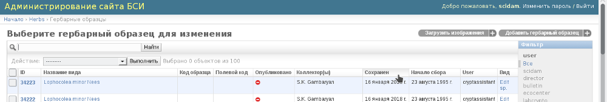
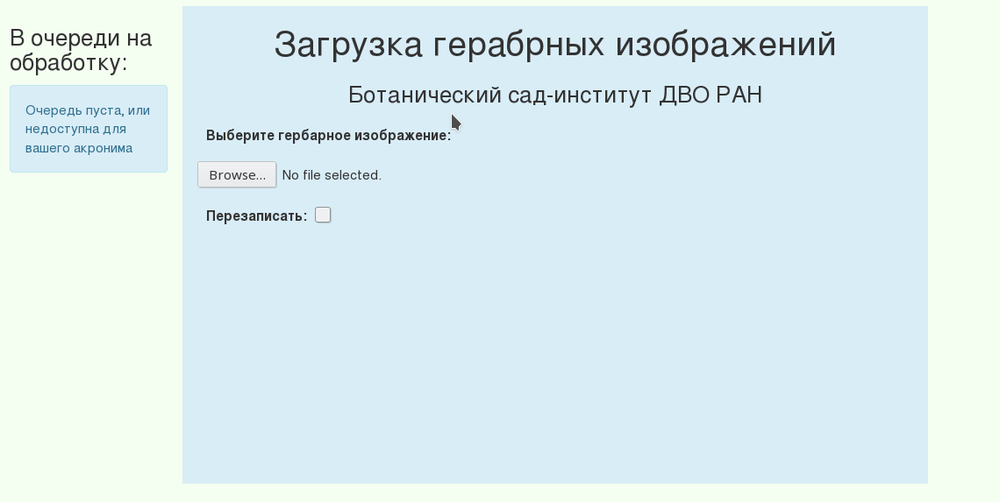
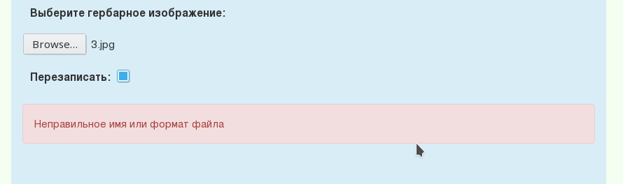
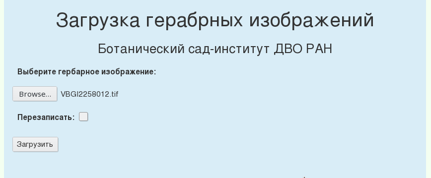
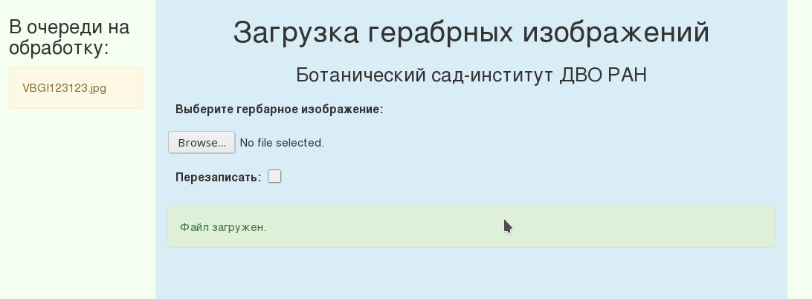

==============================
Загрузка гербарных изображений
==============================

.. |---| unicode:: U+2014  .. em dash

.. index:: сканирование образцов

.. warning::

    Данный раздел документации был существенно переработан, в результате чего были
    установлены  новые правила
    задания имен загружаемым гербарным изображениям.

Введение
~~~~~~~~

Поскольку каждое гербарное изображение предполагается представлять в высоком разрешении,
что повлечет за собой увеличение требуемого места на сервере, хранение таких изображений
будет отдельной задачей, минимально связанной с заполнением электронного гербария.

Формирование финальных web-страниц гербарных образцов будет
в этом случае осуществляться с подгрузкой
соответствующих изображений, которые должны быть
строго структурированными и привязанными
к конкретным гербарным образцам, учитывая их уникальные номера и принадлежность к акронимам.

С целью  такой привязки, а также удобства последующей автоматизированной
обработки изображений (создания малых их копий для предпросмотра и т.п.)
ниже приводится система соглашений о размещении и наименовании изображений.

.. index:: загрузка изображений, меню загрузки изображений

Меню загрузки изображений
~~~~~~~~~~~~~~~~~~~~~~~~~

Загрузка гербарных изображений в текущей реализации системы
возможна двумя способами: централизованно, из локальной сети
Ботанического сада-института ДВО РАН, или посредством
Сервиса загрузки изображений, который доступен по `адресу <https://botsad.ru/hitem/imload/>`_.

Сервис загрузки изображений доступен только пользователям,
обладающим правами куратора гербария (или суперпользователям).

Для пользователя, обладающего необходимыми правами для загрузки изображений,
страница администрирования, где представлен перечень гербарных записей
будет иметь вид, как на (:ref:`Рис. 1<fig1>`).

.. _fig1:

   Рис. 1. Фрагмент списка образоцов и дополнительное меню "Загрузить изображения" (кнопка)

При переходе по ссылке "Загрузить изображения" появится окно (:ref:`Рис. 2<fig2>`).

.. _fig2:

   Рис. 2. Сервис загрузки изображений

При нажатии кнопки :code:`Browse...` и выборе файла изображения происходит валидация
имени изображения на предмет:

* Соответствия имени файла установленному формату;
* Соответствия гербарного акронима, извлеченного из имени изображения,  и акронима, которому принадлежит пользователь, выполняющий загрузку изображения;
* Наличия файла с таким же уникальным номером и принадлежащим тому же акрониму;

Загрузки файла на удаленный сервер при валидации не происходит.

При возникновении ошибок в процессе валидации система выведет
сообщения об ошбике, см. например (:ref:`Рис. 3<fig3>`).

.. _fig3:

   Рис. 3. Пример ошибки валидации: имя файла не соответствует принятому формату.

В случае, если файл с таким же именем уже загружен в систему,
или находится на очереди на обработке, чтобы его заменить новым, необходимо отметить
флаг <Перезаписать>.

Файлы, находящиеся в очереди на обработке,
с определенной периодичностью (ориентировочно, раз в три часа),
автоматически конвертируются и публикуются. С этого момента они являются доступными
всем в сети Интернет.

После того, как валидация имени файла пройдена, будет доступна кнопка "Загрузить" (:ref:`Рис. 4<fig4>`), нажатие
которой приведет к загрузке выбранного файла на удаленный сервер и
постановку его в очередь на обработку.

.. _fig4:

   Рис. 4. Кнопка "Загрузить" доступна при успешной валидации имени файла

Поскольку файлы изображений могут быть очень большого объема (более 100 МБ),
поэтому их загрузка на сервер может занять определенное время.

По завершении загрузки, файл будет добавлен в очередь,
а также появится уведомление (на светло зеленом фоне), что
"Файл загружен" (:ref:`Рис. 5<fig5>`).

.. _fig5:

   Рис. 5. Пример успешной загрузки файла и постановки его в очередь на обработку.

В левой колонке "В очереди на обработку" отображаются загруженные файлы, но не прошедшие обработку.
При этом отображаются только те файлы, которые соответствуют тому же акрониму, что и акроним, которому
принадлежит текущий пользователь, работающий в системе. Суперпользователь может видеть все файлы,
находящиеся в данный момент в очереди на обработку.

.. index:: сохранение изображений образцов

Задание имен файлов изображений
~~~~~~~~~~~~~~~~~~~~~~~~~~~~~~~

Файлы загружаемых изображений должно быть устанолвенного формата:

Доступ к загруженным файлам
~~~~~~~~~~~~~~~~~~~~~~~~~~~

Файлы, находящиеся в очереди на обработке

Изображения, привязанные к гербарным образцам, должны
иметь имена определенного формата и размещены по каталогам следующим образом:

Общее правило названия файлов и структуры каталогов:

ACRONYM/[ID, CODE]/[ARBITRARY/SET/OF/NESTED/FOLDERS]/ddddd<_dd
>.ext

Пояснения:

        * ACRONYM |---| папка, указывающая на принадлежность изображений гербарию данного акронима (у нас это VBGI).

        * [ID, CODE] |---| ID и/или CODE;
          внутри папки акронима гербария находятся папки ID, CODE; Кроме ID и CODE |---| другие названия недопустимы,
          если внутри папки акронима, кроме этих двух (или какой-либо одной из этих двух папок) имеются
          посторонние папки/файлы, структура каталогов считается неправильной.
          В папке ID размещаются изображения, привязанные к гербарным образцам по полю ID электронной базы данных
          (это поле назначается автоматически системой при сохранении гербарных образцов);
          В папке CODE размещаются изображения, привязанные к гербарным образцам по полю CODE
          (это поле назначает куратор гербария, оно уникально внутри данного акронима);

        * [SET/OF/NESTED/FOLDERS] |---| множество вложенных папок с изображениями;
          вложения делаются лишь для удобства человека, создающего гербарные изображения;
          например, если сегодня 16 февраля 2017 года кто-либо создал некий набор изображений
          гербарных образцов, привязанных по ID, он может создать в папке ID вложенную папку,
          например, 16.02.2017, и уже туда поместить соответствующие изображения.
          В следующий день, он также может создать папку 17.02.2017 и т.д.
          Можно также выполнять разделение по семействам/родам. Наличие вложенных папок
          не обязательно, но они позволяют структурировать расположения файлов, что
          прежде всего важно для сканирующего (создающего) изображения гербарных листов человека.
        * ddddd<_dd
>.ext |---| представляет собой имя файла изображения (символы "<" и ">"
          обозначают начало и конец опциональных компонент имени файла), где:
          
                * до символа `_`  идет числовой ID либо CODE гербарного образца, к которому привязывается изображение;
         
                * после символа `_`  идет номер изображения данного гербарного образца; это делается
                  для того, чтобы отличить имена файлов гербарных изображений в случае, если одному
                  гербарному образцу соответствует несколько изображений; нумерация изображений строго идет от 1.

                * если опциональная компонента `<_dd
>` отсутствует в имени файла, то файл изображения
                  считается единственным изображением гербарного листа данного сбора;
          
                * 
 |---| опциональный символ, указывающий, что данное изображение является
                            изображением места сбора, а не гербарного образца (указывается без символов "<", ">").
          
                * .ext |---| расширение файла (обычно |---| .jpg)
          
                * ПРИМЕРЫ ВАЛИДНЫХ ИМЁН ФАЙЛОВ: 348234_1.jpg, 12345_1.jpg, 12345_1p.jpg, 83727_1.jpg, 83727_2.jpg, 132543.jpg

.. index:: авторство изображений, информация об изображениях

Авторство снимков
~~~~~~~~~~~~~~~~~

Если возникает необходимость указать авторство фотографии, наряду с файлом cнимка
должен быть подготовлен файл метаинформации.

Если имя файла снимка, допустим, 12345_1.jpg, то если необходимо назначить
авторство этой фотографии, в том же каталоге
должен быть сохранен текстовой файл с расширением .meta,
т.е.  12345_1.meta должен быть, например, следующего содержания:

{"photographer": "Dmitry E. Kislov"}

Файл должен содержать валидный JSON-форматированный текст. Кодировка при сохранении файла должа быть utf-8.

Аналогично со снимками места сбора, если имя файла снимка 123456_1p.jpg,
то имя файла метаинформации будет: 123456_1p.meta.

Пример meta-файла можно загрузить по :download:`ссылке <files/12345_1.meta>`.

Примеры размещения файлов гербарных образцов
~~~~~~~~~~~~~~~~~~~~~~~~~~~~~~~~~~~~~~~~~~~~

    * размещение без вложенной структуры каталогов (в куче): VBGI/ID/132432_1.jpg, VBGI/ID/132432_2.jpg, ...; VBGI/CODE/13212_1.jpg, VBGI/CODE/13211_1.jpg,...

    * размещение с пользовательской структурой каталогов: VBGI/ID/17.02.2017/63723_1.jpg, VBGI/CODE/18.02.2017/65123_1.jpg, VBGI/CODE/18.02.2017/65123_1p.jpg, ...

.. index:: доступ к изображениям

Доступ к файлам
---------------

Вводимая выше структура каталогов предназначена для удобной организации работы
с изображениями и последующей их автоматизированной обработки с целью
загрузки на сервер.

Обработанные файлы изображений будут доступны для чтения по протоколу HTTP по адресам:

 * http://BASE_URL/ss/ACRONYM/ddddd<_dd
>.ext
 * http://BASE_URL/ms/ACRONYM/ddddd<_dd
>.ext
 * http://BASE_URL/fs/ACRONYM/ddddd<_dd
>.ext

где BASE_URL |---| адрес сервера, через который будут доступны
изображения (возможно botsad.ru, возможно, какой-нибудь herbstatic.botsad.ru); далее |---|  ss, ms, fs  |---| указывают
на пути к изображениям различного разрешения: ss (small size) |---| максимальная ширина или высота 100 px,
ms (medium size) |---| максимальная ширина или высота изображения 2000 px; fs (full size) |---|
максимальная ширина или высота ограничивается возможностью сканирующего устройства.

Пользовательская структура каталогов (SET/OF/NESTED/FOLDERS) при размещении на сервере не сохраняется.

Режим доступа к изображениям размера full size |---|  будет
регламентирован позже (при введении базы в эксплуатацию).

.. note::

   Система автоматически определяет ID привязанных к снимку гербарных записей, если до символа '_'
   в названии изображения приведен CODE. При копировании на сервер такие изображения автоматически
   переименовываются так, чтобы наименование файла содержало ID.

.. index:: калибровочные ячейки, калибровка изображений

Калибровочные ячейки
--------------------

Крайне рекомендуется на сканах гербарных образцов представлять калибровочные ячейки, и желательно, разных цветов.

Калибровочные ячейки используются для автоматизированного пересчета соответствия между "количеством пикселей" и
принятыми единицами длины.

Калибровочные ячейки должны быть строго одинаковыми для всех изображений, размером |---| 1 cm x 1 cm.

Установленный формат калибровочных ячеек
можно найти по :download:`ссылке <files/color_cells.pdf>`

Выполненные в ярких разных цветах калибровочные квадраты позволят
потенциальным пользователям электронного гербария
идентифицировать где находится калибровочный квадрат, а
где элемент растительности в автоматизированном режиме при помощи
соответствующих программных решений.

.. index:: пример гербария с калибровочными ячейками

Пример гербарного изображения с калибровочными ячейками можно посмотреть ниже.

.. image:: http://insider.si.edu/wordpress/wp-content/uploads/2011/01/us00002212.jpg
   :width: 500 px
   :align: center

