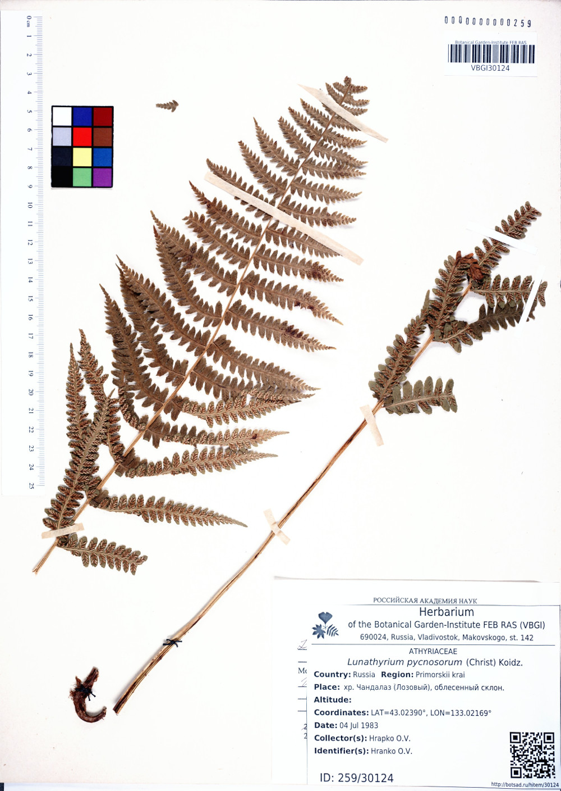

===========================================
Подготовка и загрузка гербарных изображений
===========================================

.. contents:: :local:

.. |---| unicode:: U+2014  .. em dash

.. |--| unicode:: U+2013   .. en dash

.. index:: сканирование образцов

.. warning::

    Данный раздел документации был существенно переработан, в результате чего были
    установлены новые правила  задания имен гербарных изображений.

Введение
~~~~~~~~

Поскольку каждое гербарное изображение предполагается представлять в высоком разрешении,
что повлечет за собой увеличение требуемого места на сервере, хранение таких изображений
будет отдельной задачей, минимально связанной с заполнением электронного гербария.

Формирование финальных web-страниц гербарных образцов будет
в этом случае осуществляться с подгрузкой
соответствующих изображений, которые должны быть
строго структурированными и привязанными
к конкретным гербарным образцам, учитывая их уникальные номера и принадлежность к акронимам.

С целью  такой привязки, а также удобства последующей автоматизированной
обработки изображений (создания малых их копий для предпросмотра и т.п.)
ниже приводится система соглашений о размещении и наименовании изображений.

.. index:: загрузка изображений, меню загрузки изображений

Меню загрузки изображений
~~~~~~~~~~~~~~~~~~~~~~~~~

Загрузка гербарных изображений в текущей реализации системы
возможна двумя способами: централизованно, из локальной сети
Ботанического сада-института ДВО РАН, или посредством
Сервиса загрузки изображений, который доступен по `адресу <https://botsad.ru/hitem/imload/>`_.

Сервис загрузки изображений доступен только пользователям,
обладающим правами куратора гербария или суперпользователя.

Для пользователя, обладающего необходимыми правами для загрузки изображений,
страница администрирования, где представлен перечень гербарных записей
будет иметь вид, как на (:ref:`Рис. 1<pic1>`).

.. _pic1:

.. figure:: files/imloading/Screenshot_20180117_155220.png
   :alt: Загрузить изображения (кнопка)
   :align: center

   Рис. 1. Фрагмент списка образцов и дополнительное меню "Загрузить изображения" (кнопка)

При переходе по ссылке "Загрузить изображения" появится окно (:ref:`Рис. 2<pic2>`).

.. _pic2:

.. figure:: files/imloading/Screenshot_20180117_161515.png
   :alt: Сервис загрузки изображений (вид)
   :align: center

   Рис. 2. Сервис загрузки изображений

При нажатии кнопки :code:`Browse...` и выборе файла изображения происходит валидация
имени изображения на предмет:

* Соответствия имени файла установленному формату;
* Соответствия гербарного акронима, извлеченного из имени изображения, и акронима,
  которому принадлежит пользователь, выполняющий загрузку изображения;
* Наличия файла с таким же уникальным номером и принадлежащим тому же акрониму;

Загрузки файла на удаленный сервер на этапе валидации не происходит.

При возникновении ошибок в процессе валидации система выведет
сообщения об ошбике, см. например (:ref:`Рис. 3<pic3>`).

.. _pic3:

.. figure:: files/imloading/Screenshot_20180117_162302.png
   :alt: Ошибка валидации: имя файла имеет неправильный форма
   :align: center

   Рис. 3. Пример ошибки валидации: имя файла не соответствует принятому формату.

В случае, если файл с таким же именем уже загружен в систему,
или находится в очереди на обработке, чтобы его заменить новым, необходимо отметить
флаг <Перезаписать>.

Файлы, находящиеся в очереди на обработке,
с определенной периодичностью (ориентировочно, раз в три часа),
автоматически конвертируются и публикуются. С этого момента они являются доступными
всем в сети Интернет.

После того, как валидация имени файла пройдена,
будет доступна кнопка "Загрузить" (:ref:`Рис. 4<pic4>`), нажатие
которой приведет к загрузке выбранного файла на удаленный сервер и
постановку его в очередь на обработку.

.. _pic4:

   Рис. 4. Кнопка "Загрузить" доступна при успешной валидации имени файла

Поскольку файлы изображений могут быть очень большого объема (более 100 МБ),
поэтому их загрузка на сервер может занять определенное время.

По завершении загрузки, файл будет добавлен в очередь,
а также появится уведомление (на светло-зеленом фоне), что
"Файл загружен" (:ref:`Рис. 5<pic5>`).

.. _pic5:

.. figure:: files/imloading/Screenshot_20180117_163141.png
   :alt: Файл успешно загружен и поставлен в очередь на обработку (пример)
   :align: center

   Рис. 5. Пример успешной загрузки файла и постановки его в очередь на обработку.

В левой колонке "В очереди на обработку" отображаются загруженные файлы, но не прошедшие обработку.
При этом отображаются только те файлы, которые соответствуют тому же акрониму, что и акроним, которому
принадлежит текущий пользователь, работающий в системе. Суперпользователь может видеть все файлы,
находящиеся в данный момент в очереди на обработку.

Доступ к обработанным файлам
~~~~~~~~~~~~~~~~~~~~~~~~~~~~

После обработки файлы доступны для свободной загрузки
по сети Интернет.

URI файла при этом формируется из его названия, акронима и пути, указанном в
параметре SOURCE_IMAGE_URL_. Текущее значение этого параметра

   SOURCE_IMAGE_URL = `http://botsad.ru/herbarium/view/snapshots`

Например, если файл `VBGI30124.tiff` был загружен в систему, тогда он доступен
по протоколу (HTTP/HTTPS) по адресам:

* http://botsad.ru/herbarium/view/snapshots/VBGI/ts/VBGI30124.jpg
* http://botsad.ru/herbarium/view/snapshots/VBGI/ss/VBGI30124.jpg
* http://botsad.ru/herbarium/view/snapshots/VBGI/ms/VBGI30124.jpg
* http://botsad.ru/herbarium/view/snapshots/VBGI/fs/VBGI30124.jpg

Фрагменты пути `ts`, `ss`, `ms`, `fs` |---| используются, чтобы обозначить
размер соответствующего файла (конкретные
значения размеров, определены в `файле спецификации`_: `ts` (thumbnail size) |--| минимальный размер,
`ss` (small size) |--| маленький размер, `ms` (medium size) |--| средний размер,
`fs` (full size) |--| полный размер.

.. warning::

   Веб-интерфейс (http://botsad.ru/herbarium) и HTTP API интерфейс (http://botsad.ru/hitem/json)
   "узнают" о наличии новых гербарных снимков в течение суток. Однако, файл изображения становится
   доступным (по указанным в примере выше ссылкам)
   для загрузки по сети Интернет уже после своей обработки и удаления из очереди.

.. _SOURCE_IMAGE_URL:  https://github.com/VBGI/herbs/blob/master/herbs/conf.py

Параметры сжатия изображений
~~~~~~~~~~~~~~~~~~~~~~~~~~~~

Для конвертирования изображений используется набор утилит обработки изображений `ImageMagick`_,
при этом параметры, используемые для сжатия, определяются в переменной конфигурации:
IMAGE_CONVERSION_OPTS_.

.. note::

    Все изображения конвертируются в формат `*.jpg`. Текущие параметры сжатия:

    .. code:: python

        '-strip', '-interlace', 'Plane',
        '-sampling-factor', r'4:2:0',
        '-quality', r'90%'

Практика показывает, что используемый набор параметров не оказывает видимого эффекта на изображения.
Вместе с тем, использование сжатия позволяет существенно сократить требуемое
дисковое пространство.

.. _ImageMagick: http://imagemagick.org

.. _IMAGE_CONVERSION_OPTS:  https://github.com/VBGI/herbs/blob/master/herbs/management/process_images.py

.. _файле спецификации: https://github.com/VBGI/herbs/blob/master/herbs/management/process_images.py

.. index:: сохранение изображений образцов

Названия файлов изображений
~~~~~~~~~~~~~~~~~~~~~~~~~~~

Файлы загружаемых изображений должны быть устанолвенного формата:

   ACRONYMXXXX<_XX>[.tiff][.tif][.jpg][.jpeg]

* ACRONYM |--| название гербарного акронима (заглавными буквами), которому принадлежит
  гербарный образец; например, VBGI, SAKH, ABGI и др.
* XXXX |--| уникальный числовой код образца (**ID** образца, назначаемый системой);
* <_XX> |--| опциональный код; указывается после символа `_`, задается пользователем, используется в случае,
   если данному гербарному сбору соответствуют несколько изображений;
* [.tiff][.tif][.jpg][.jpeg]  |--| расширение файла (регистр расширения не имеет значения),
  указывающее на его формат (одно из перечисленных в квадратных скобках значений);

Примеры валидных имен файлов изображений:

-   VBGI123.jpg
-   VBGI123_1.jpg
-   ABGI9933.tiff
-   SAKH3842.jpeg

Калибровочные ячейки
~~~~~~~~~~~~~~~~~~~~

Крайне рекомендуется на сканах гербарных образцов представлять калибровочные ячейки,
и желательно, различных цветов.

Калибровочные ячейки используются для автоматизированного пересчета соответствия между "количеством пикселей" и
принятыми единицами длины, а также для автоматической цветокоррекции изображений.

Калибровочные ячейки должны быть строго одинаковыми для всех изображений, размером |---| 1 cm x 1 cm.

Установленный формат калибровочных ячеек
можно найти по :download:`ссылке <files/color_cells.pdf>`

.. index:: пример гербария с калибровочными ячейками

Пример гербарного изображения с калибровочными ячейками дан ниже.

