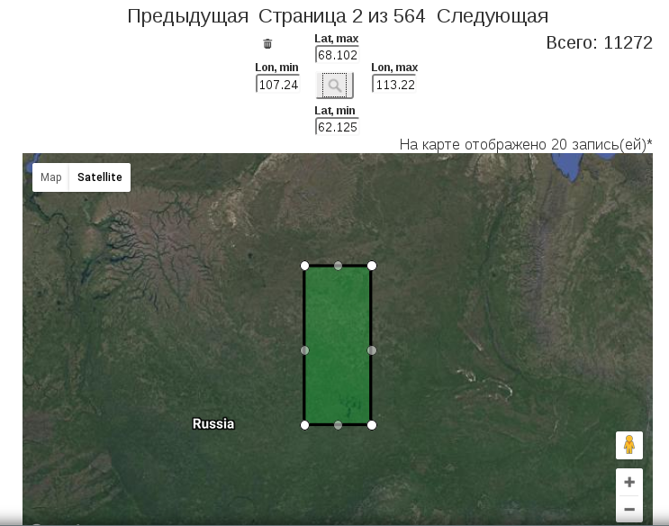

======================================
Базовый поиск по электронному гербарию
======================================

.. |---| unicode:: U+2014  .. em dash

Доступ к данным электронного гербария осуществляется либо через предоставляемый web-интерфейс
на `официальном сайте организации <http://botsad.ru/herbarium>`_,
либо посредством использования :doc:`сервиса <http_api>` автоматизированной обработки поисковых запросов.

В поиске участвуют только опубликованные гербарные записи.

Базовые поисковые операции возможны через поисковое меню на странице каталога электронного гербария (:ref:`Рис. 1<fig1>`)

.. index:: поиск, web-форма

.. _fig1:

.. figure:: files/search/1.png
   :alt: Стандартные поисковые операции
   :align: center

   Рис. 1. Вид стандартного поискового меню

При задании нескольких условий в поисковом меню результатом поиска являются записи,
для которых выполняются все условия одновременно. Таким образом, поисковое меню позволяет
формировать поисковые запросы типа **И**. При необходимости выполнения поисковых запросов
типа **ИЛИ** рекомендуется использовать предоставляемый
:doc:`сервис <http_api>` автоматизации поисковых запросов.

Выбор значений полей **Семейство**, **Род** и **Страна** осуществляется из выпадающего списка,
формируемого исходя из известных  семейств, родов |---| у опубликованных
образцов и всех известных стран соответственно.

Дата начала и окончания сбора задаются при помощи автоматически
всплывающего календаря при попытке внесения значений в эти поля.

В случае задания только даты начала сбора |---| условие поиска считается выполненным для тех записей,
у которых дата начала сбора больше указанной даты начала сбора.

В случае задания только даты окончания сбора |---| условие поиска считается выполненным для 
тех записей, у которых дата окончания сбора меньше указанной даты окончания сбора.

В случае задания дат начала и окончания сбора одновременно |---| условие поиска считается
выполненным для тех записей, у которых интервал соответствующих дат пересекается
с указанным временным интервалом сбора.

В отношении остальных текстовых полей |---|
**видовой эпитет**, **код**, **собрали**, **определили**, **место сбора** |---|
выполнение поискового условия предполагает включение  введенной подстроки
(без учёта регистра) в соответствующее поле записей таблицы опубликованных гербарных записей.

Булевы поля **Учитывать синонимы** и **Искать в дополнительных видах**
указывают, что: в первом случае |---| дополнительно будет использоваться
таблица синонимов видов при поиске образцов, а во втором случае |---| что поиск
также будет распространяться на присоединённые к данному гербарному сбору
другие виды (для мультивидовых сборов).
В случае, когда отмечены оба поля поиск по известным системе синонимам видов будет
проводится также и во всех присоединённых видах гербарных сборов.

**Примечание.** Функция учитывать синонимы работает только в случае точного
указания пары (род, видовой эпитет), в противном случае |---| условие поиска по
синонимам игнорируется и в результатах поиска выводится соответствующее предупреждение,
что условие было проигнорировано.

Стандартный поисковый интерфейс предоставляет возможность фильтрации результатов поиска
по подразделам гербария, а также по гербарным акронимам. 
Панель фильтрации результатов поиска дана на  :ref:`Рис. 2<fig2>`.

.. index:: фильтр поиска

.. _fig2:

   Рис. 2. Панель фильтрации результатов поиска

Панель фильтрации результатов поиска имеет следующие поля:

* **Количество** |---|  количество найденных образцов, отображаемых на одной странице;
* **Название гербария** |---|  ограничение результатов поиска акрониму;
* **Подраздел гербария** |---|  ограничение результатов поиска по подразделу гербария;
* **Упорядочить** |---|  упорядочивание результатов по какому-либо из полей; справа |---| булево поле для
                         смены порядка отображаемых результатов.

Вид панели результатов выполнения поискового запроса дан на :ref:`Рис. 3<fig3>`.

Во вкладке **Общая информация** выводится перечень удовлетворяющих текущему поисковому условию
(в случае, если никаких поисковых условий не было задано |---| выводятся все опубликованные записи,
внесённые в базу на текущий момент).

Вкладка **Информация об образце** активируется, при попытке посмотреть
информацию о конкретной гербарной записи в таблице результатов.
В этой вкладке отображается уменьшенная копия персональной страницы образца.

Вкладка **Карта** представляет собой результаты поиска с их отображением на карте.
Как и в случае со вкладкой **Общая информация** на карте отображается
только одна страница результатов поиска.Страницы результатов поиска можно листать,
нажимая ссылки **Предыдущая** и **Следующая**, что приведет
к синхронному изменению отображаемых записей как на **Карте**,
так и во вкладке **Общая информация**.

Вкладка **Автоматизация доступа** содержит общую информацию об организации автоматизированного
доступа посредством предоставляемого :doc:`сервиса HTTP API <http_api>`.

Во вкладке **Карта** также имеется возможность фильтрации результатов поиска
по прямоугольной области, определённой пользователем на карте.
Если область географической фильтрации задана, то в поиске участвуют только
те записи, у которых определены географические координаты сбора.

.. _fig3:

   Рис. 3. Панель результатов поиска

Для активации поиска по географической области необходимо нажать
(или дважды кликнуть по окну карты) на кнопку поиска.
При этом на карте появится редактируемая прямоугольная область поиска (:ref:`Рис. 4<fig4>`, :ref:`Рис. 5<fig5>`).

.. index::  карта

.. _fig4:

   Рис. 4. Выделение области

.. _fig5:

   Рис. 5. Выделение области

Для выполнения поиска, после завершения процедуры редактирования
поисковой области, необходимо повторно нажать на кнопку поиска.
Это приведёт к ограничению результатов поиска только образцами, принадлежащей
выделенной области. Для отмены поискового условия по области необходимо
нажать на значок **урны** слева от отображаемых координат |---| границ заданной поисковой области.

.. index::  поиск по области

Выполнение поиска по более сложным |---| полигональным
поисковым областям в текущей реализации |---| на  базе MySQL |---|
не поддерживаются системой, однако,
такой вид поисковых запросов может быть эмулирован программно,
в частности, на базе использования предоставляемого сервиса автоматизации поисковых запросов
(см. :ref:`раздел Дополнительно<search_httpapi_examples>`).

При просмотре информации об образце
(клик по маркеру на карте, либо по строке в таблице из вкладки **Общая информация**)
происходит автоматический переход во вкладку **Информация об образце**.
